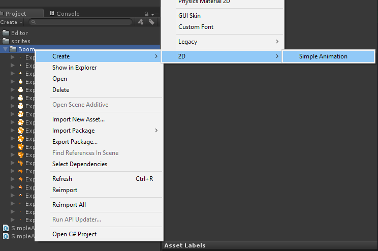
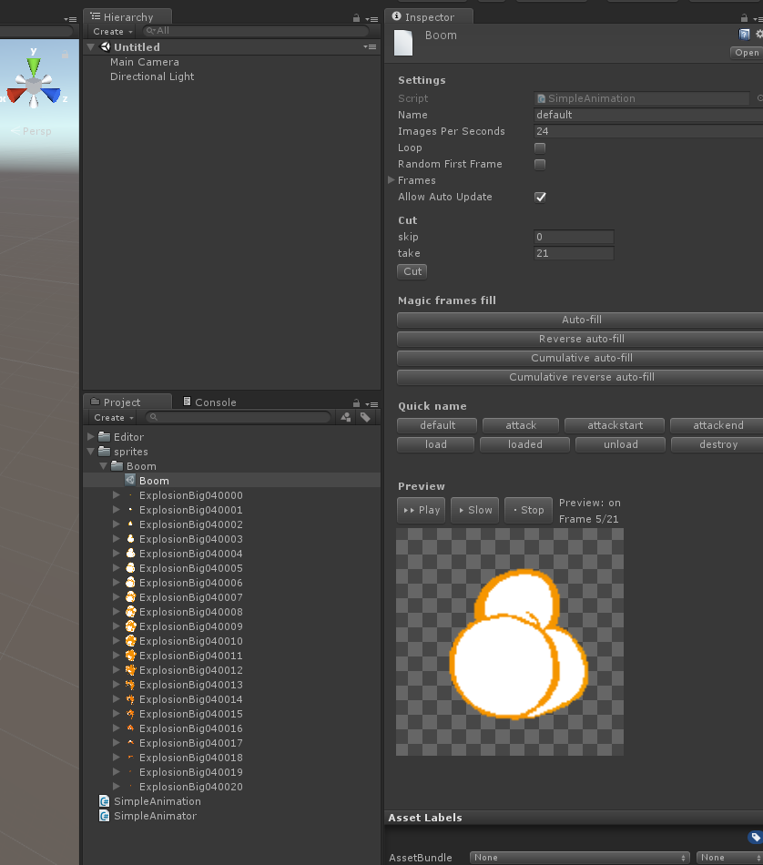
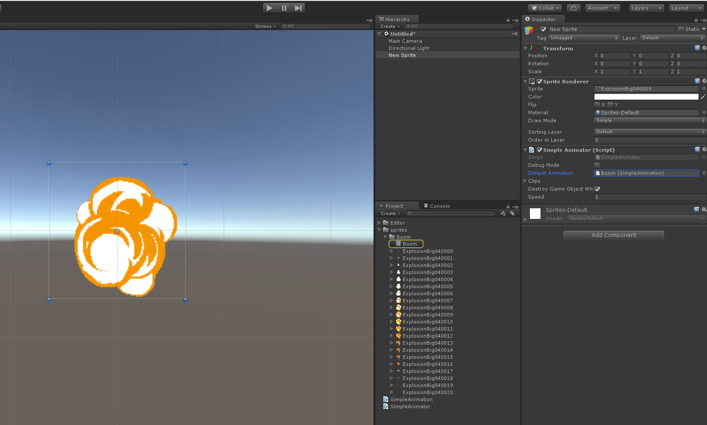

# SimpleAnimator-unity

A simple 2D animator for Unity, lightweight and easier to use than Mecanim for large volumes of sprites or files that often change.

Compatible with Unity 4.2+.

Used in the game [Steredenn](http://steredenn.pixelnest.io) to handle 24000 sprites and thousands of animations.

**Disclaimer: this is a very rough release and it is provided ith no support!**

## Installation

- Download the sources and copy them to your project.

OR

- Download the latest release and install the `.unitypackage` in your project.

## Usage

1/ Right-clic on a folder with all your animation frames


2/ Create a new 2D/Simple Animation



3/ A ScriptableObject should have been created. You can preview the animation and tweak the settings.



4/ Create a GameObject with a SpriteRenderer and a SimpleAnimator.
5/ Assign the created animation object to the SimpleAnimator. If you have several animations, you should list them all in `clips`.



5/ Your animation should now play. If you want the GameObject to be automatically destroyed at the end of the animation, check the following setting:


## Code usage

```csharp
var anim = GetComponent<SimpleAnimator>();
anim.Play("attack");
```
